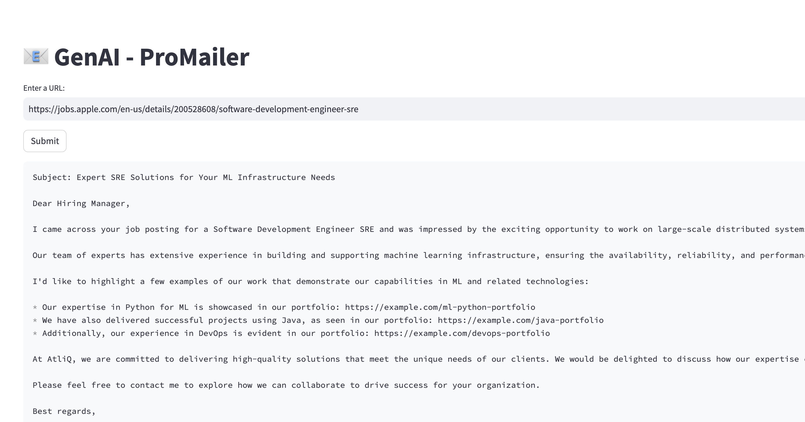

# 📧 GenAI - ProMailer
Cold email generator for services company using groq, langchain and streamlit. It allows users to input the URL of a company's careers page. The tool then extracts job listings from that page and generates personalized cold emails. These emails include relevant portfolio links sourced from a vector database, based on the specific job descriptions. 

**Imagine a scenario:**

Scenario for Apple:

Apple's Hiring Needs: Apple is actively searching for a Software Development Engineer in Site Reliability Engineering (SRE) to enhance its machine learning infrastructure and large-scale distributed systems, dedicating significant resources to the hiring, onboarding, and training process.

Atliq's Expertise: Atliq, a software development company, has a team of experts with extensive experience in Python, Java, and DevOps for machine learning applications. They can provide a dedicated software engineer skilled in these areas to meet Apple's immediate needs.

Business Outreach: Ram, a business development executive at Atliq, sends a cold email to Apple, proposing a partnership where Atliq's dedicated engineer can quickly integrate into Apple's team, reducing the time and cost associated with traditional hiring and training.



## Architecture Diagram


## Set-up
1. To get started we first need to get an API_KEY from here: https://console.groq.com/keys. Inside `app/.env` update the value of `GROQ_API_KEY` with the API_KEY you created. 


2. To get started, first install the dependencies using:
    ```commandline
     pip install -r requirements.txt
    ```
   
3. Run the streamlit app:
   ```commandline
   streamlit run app/main.py
   ```
   